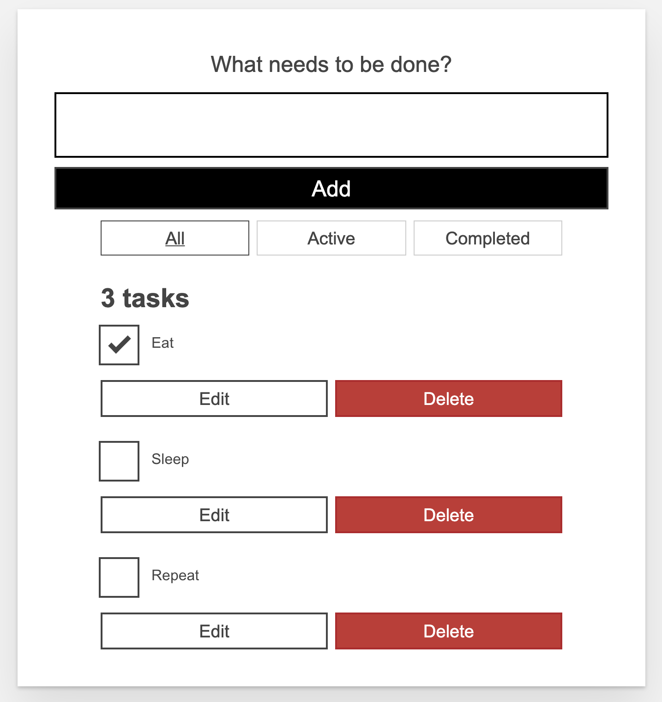

# Knowledge Assessment

## Instructions

This project is a simple tasklist application that has the following functional requirements.

- A user should be able to add new tasks
- A user should be able to delete tasks
- A user should be able to edit tasks to change the name
  - While a task is in edit mode a user should be able to cancel or save
- A user should be able to mark a task as completed
- A user should be able to filter the task list using the filter button toggles at the top
- The count of the tasks should be updated whenever the tasklist shown changes.

The goal of this assessment is to find and fix all the bugs so that the functional spec above is fulfilled.

### Time Limit

60 Minutes

### Before you begin

1. Run `npm install` to install all the dependencies for the app

### Problems

#### Compile Time Bugs

The first challenge is to fix the compile time errors.

Run `npm start`. You will notice a couple of errors. Please track down and fix the problems identified.
Any change you make will automatically rebuilt and be hot reloaded.
The linter can be your friend here (both the problems tab and the build output in the terminal should show relevant information here).

#### Application Bugs

- The delete button for a task is not working (causes an error)
- The Active filter toggle is not working.  The filter, when active, should only show the tasks that are not yet completed.
- The task counter does not get updated when a filter is active.
- **Bonus** - Currently, when toggling a `<Todo/>` template from viewing to editing the `<input>` field does not receive focus. The expected behavior is that when a user toggles a `<Todo/>` template from viewing to editing, we should focus on the `<input>`used to rename it; when they toggle back from editing to viewing, we should move focus back to the "Edit" button.  **Hint**: ReactJs refs (via the useRef hook) comes in handy here.
